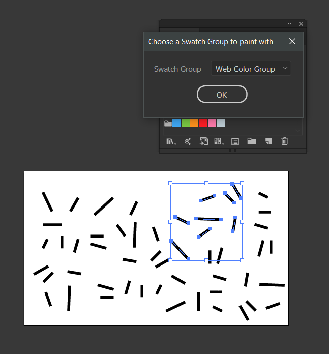
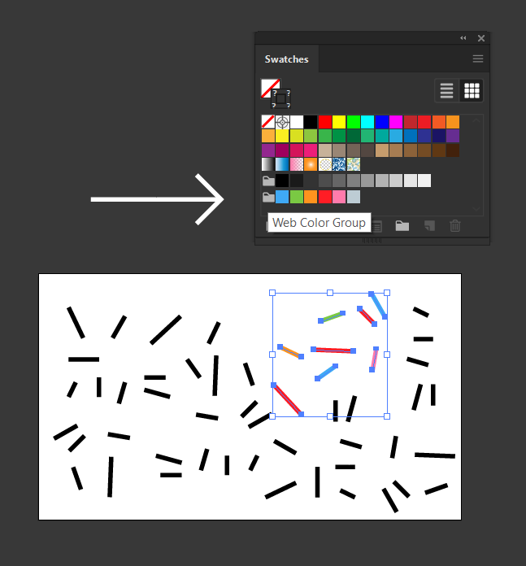

# Outliner

Illustrator script to paint paths randomly by specified Swatch Group contents.

## Usage

### Launch creates modal dialog with dropdown of Swatch Groups:

### Hit OK for result:

Created by request of a reddit thread: [How to color shapes randomly?](https://www.reddit.com/r/AdobeIllustrator/comments/e2gks4/how_to_color_shapes_randomly/)

## NOTES

- 'All' refers to swatches within an unnamed Group, not the entirety of all SwatchGroups.
- This script does not alter multiple strokes/fills within the Appearance panel, and only has access to a single stroke/fill per item
- The ScriptUI panel shows a graphical error where the dropdown list contents are clipped if extending past the window. The arrow keys can be used to select any entry even if it isn't visible
